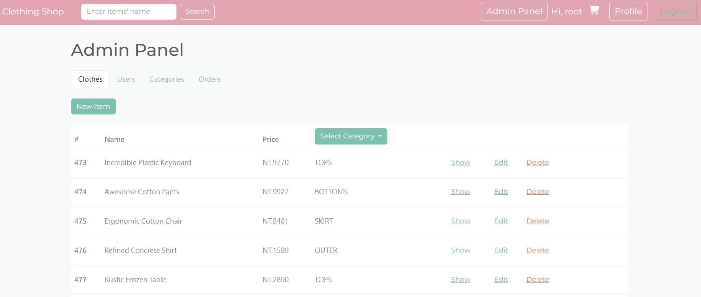

# Clothing Shop


## Introduction

This is an online clothing shopping website. 


## Features

**Register/ Log in/ Log out**

- Users can register own account or log in by Facebook.


**Admin Panel**

- Only administrators have permission to enter.
- On clothes page, admin can create a new product, edit the product or change the cover photo of product, delete the product. Also can select the category to check the product of the category.
- On users page, admin can set the account to the user or admin except the certain account(root@example.com.tw) can not set to the user.
- On the categories page, admin can create, edit, delete the category.
- On the orders page, admin can check the customers orders are "Processing" or "Done". Check the detail order can change the status of the order. 

Admin Clothes Page

Admin Users Page

Admin Categories Page

Admin Orders Page


**Customer**

- Click on the heart icon to add the product to "Favorite" or remove the "Favorite".
- Add the product to the cart.
- On the cart page, customer can edit the quantity of the product, take a note to retailer.
- On the user profile page, customer can check the orders and favorites.


## Installation

1. Confirm you have already install the npm and node.js
2. Clone this repository
   ```
   https://github.com/JingYi120/clothing_shop.git
   ```
3. Confirmed the terminal is at the project
   ```
   cd clothing_shop
   ```
4. Project setup & Install nodemon
   ```
   npm install
   npm i nodemon
   ```
5. Create a `.env` file
   ```
   IMGUR_CLIENT_ID=
   FACEBOOK_ID=
   FACEBOOK_SECRET=
   FACEBOOK_CALLBACK=
   ```
6. Create the database "clothing_shop" in MySQL
   ```
   drop database if exists clothing_shop;
   create database clothing_shop;
   use clothing_shop;
   ```
7. Create tables and seeders
   ```
   sequelize db:migrate
   sequelize db:seed:all
   ```
8. Start the server
   ```
   npm run dev
   ```
   It's successful that terminal show "Express is listening on http://localhost:3000"
9. You can use the account and password to log in and experience the website.:
   | Role | account  | password |
   | --- | --- | --- |
   | Admin | root@example.com.tw | 12345678 |
   | Customer | user1@example.com.tw  | 12345678 |
10. stop server
    ```
    ctrl + c
    ```